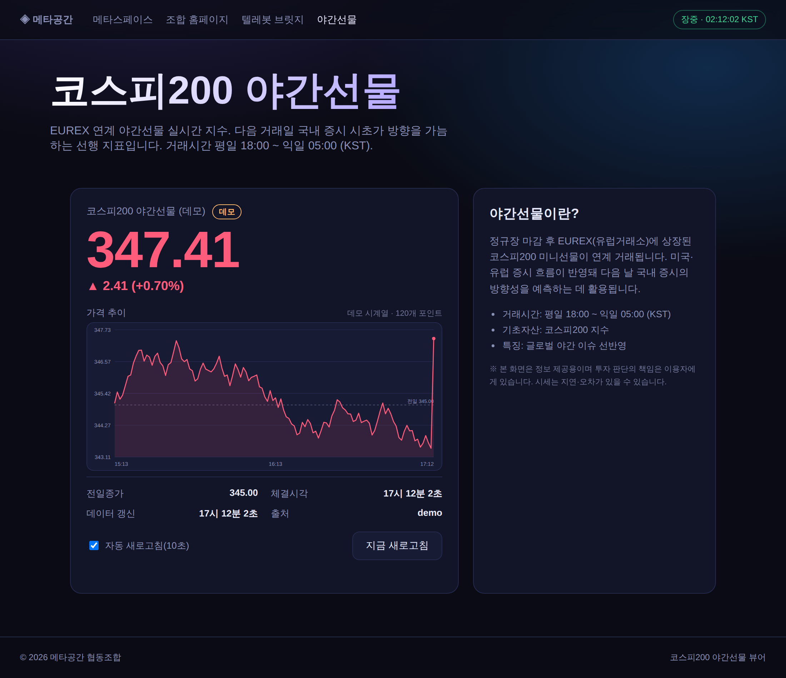

# 메타공간 플랫폼 (Metaspace Platform)

메타공간, 협동조합 홈페이지, 텔레봇 브릿지를 하나로 묶은 오픈 플랫폼입니다.

## 구성

- `/` — 메타스페이스 로비 (2D 캔버스 월드, WASD 이동)
- `/coop.html` — 메타공간 협동조합 소개 및 가입 신청
- `/bridge.html` — 텔레그램 ↔ 메타공간 브릿지 (온라인)
- `/kospi.html` — 코스피200 야간선물(EUREX 연계) 실시간 지수 뷰어
- `/overnight/SAMSUNG`, `/overnight-samsung.html` — 삼성전자 야간선물·독일 GDR 실시간 뷰어
- `/overnight/HYNIX`, `/overnight-hynix.html` — SK하이닉스 야간선물·독일 GDR 실시간 뷰어

## 실행

```bash
npm install
npm start
# http://localhost:3000
```

## 텔레봇 브릿지 API

- `GET  /api/bridge/status` — 브릿지 상태
- `POST /api/bridge/toggle` — 온/오프 전환
- `POST /api/bridge/send` — 메시지 전송 (body: `{ chatId, text, botToken? }`)
- `POST /api/bridge/webhook` — 텔레그램 웹훅 수신
- `GET  /api/bridge/messages` — 최근 로그 30건

`botToken`과 `chatId`가 함께 전달되면 실제 텔레그램 API(`api.telegram.org`)로
릴레이하고, 비어 있으면 로컬 에코 모드로 동작합니다.

## 코스피200 야간선물 뷰어



> 위 미리보기는 데모 모드(`?demo=1`)로 캡처한 화면입니다.

`/kospi.html` 은 코스피200 야간선물(KRX 파생 야간시장, 평일 18:00~익일 06:00 KST)
실시간 지수를 보여줍니다. 현재가·등락·등락률·전일종가·세션 상태와 함께
가격 추이 차트(축·격자·전일종가 기준선)를 그리고 10초마다 자동 갱신합니다.
차트는 시계열을 먼저 불러온 뒤 실시간 시세를 이어 붙입니다.
(한국 관행대로 상승=빨강, 하락=파랑)

- `GET /api/kospi-night` — 정규화된 시세 JSON
  (`{ status, value, change, changeRate, prevClose, time, source, session }`)
- `GET /api/kospi-night/history` — 차트용 시계열 JSON (`{ status, source, series:[{t,v}] }`)
- `?demo=1` — 데이터 소스 없이 동작 확인용 데모 시세/시계열

### 데이터 소스 설정

서버가 외부 시세 소스를 대신 호출해 CORS 없이 정규화합니다. 응답 필드명이
조금 달라도 견디도록 방어적으로 파싱하며, 어떤 소스도 응답하지 않으면 가짜
시세를 만들지 않고 `status:"unavailable"` 을 반환합니다.

| 환경변수 | 설명 | 기본값 |
|----------|------|--------|
| `KOSPI_NIGHT_API_URL` | 현재 시세를 가져올 JSON 엔드포인트(설정 시 이 URL만 사용) | 네이버 금융 모바일 API |
| `KOSPI_NIGHT_CHART_URL` | 차트 시계열을 가져올 JSON 엔드포인트 | 네이버 금융 차트 API |
| `KOSPI_NIGHT_DEMO` | `1` 이면 항상 데모 시세/시계열 반환 | 미설정 |

> 라이브 시세를 받으려면 배포 환경에서 시세 소스 호스트로의 아웃바운드 접근이
> 허용돼야 합니다(예: `api.stock.naver.com`). 차단된 환경에서는 `?demo=1`
> 로 UI를 확인하거나 접근 가능한 소스를 `KOSPI_NIGHT_API_URL` 로 지정하세요.

## 개별 종목 야간(독일 GDR) 뷰어

`/overnight-samsung.html`, `/overnight-hynix.html` (그리고 `/overnight/SAMSUNG`,
`/overnight/HYNIX` 경로 별칭)은 삼성전자·SK하이닉스가 독일거래소(프랑크푸르트)에서
GDR(예탁증서)로 거래되는 야간 시세를 코스피200 야간선물과 같은 UI로 보여줍니다.

- `GET /api/overnight/:symbol` — `SYMBOL`은 `SAMSUNG` 또는 `HYNIX`. 정규화된 시세 JSON
- `GET /api/overnight/:symbol/history` — 차트용 시계열 JSON
- `?demo=1` — 데모 시세/시계열로 동작 확인

GDR 시세는 확인된 무료 JSON API가 없어 기본값은 소스 미설정(`status:"unavailable"`)
상태입니다. 실시간 연동이 필요하면 아래 환경변수로 자체 데이터 소스(벤더 API,
스크레이퍼 등)를 지정하세요.

| 환경변수 | 설명 |
|----------|------|
| `OVERNIGHT_SAMSUNG_API_URL` / `OVERNIGHT_SAMSUNG_CHART_URL` | 삼성전자 GDR 시세/차트 소스 |
| `OVERNIGHT_HYNIX_API_URL` / `OVERNIGHT_HYNIX_CHART_URL` | SK하이닉스 GDR 시세/차트 소스 |
| `OVERNIGHT_SAMSUNG_DEMO`, `OVERNIGHT_HYNIX_DEMO` | `1`이면 항상 데모 값 반환 |

## 협동조합 API

- `GET /api/coop/info` — 조합 기본 정보

## 라이브 배포

### A. GitHub Pages (정적 UI만)
`.github/workflows/deploy-pages.yml`이 `public/` 디렉터리를 Pages로 배포합니다.
브릿지·뉴스 API는 동작하지 않고 `config.js`의 `apiBase`를 외부 Node 서버 주소로
설정하면 UI가 해당 서버에 연결됩니다.

> **주의**: 이 저장소의 `github-pages` 환경은 기본 브랜치에만 배포를 허용합니다.
> 기능 브랜치에서 자동 실행하면 "environment protection rules" 오류로 실패하므로,
> 워크플로는 `workflow_dispatch`(수동 트리거) 전용으로 설정되어 있습니다.

1. 이 브랜치를 기본 브랜치로 병합
2. Settings → Pages → Source: **GitHub Actions**
3. Actions 탭 → "Deploy static UI to GitHub Pages" → **Run workflow**

### B. 풀스택 호스팅 (권장)

| 플랫폼 | 파일 | 명령 |
|--------|------|------|
| Render | `render.yaml` | 대시보드에서 Blueprint 연결 |
| Fly.io | `fly.toml` | `flyctl launch --copy-config && flyctl deploy` |
| Heroku | `Procfile` | `heroku create && git push heroku` |
| Docker | `Dockerfile` | `docker build -t metaspace . && docker run -p 3000:3000 metaspace` |

배포 후 `config.js`의 `apiBase`를 배포 도메인으로 덮어써 Pages UI와 연결할 수
있습니다(CORS 허용 필요 시 서버 코드에 미들웨어 추가).

## 브랜치

`claude/build-metaspace-platform-APHlN`
